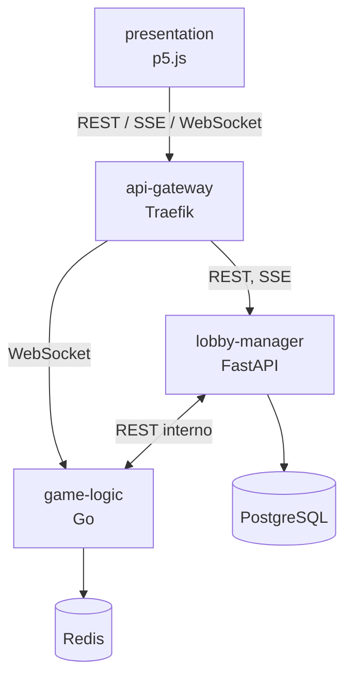

# Bololó (ArchSoft 1-F)

Juego de cartas por rondas para 4 jugadores, construido como sistema distribuido. Cada componente de la vista C&C tiene su propia carpeta, que se construye y despliega como un contenedor independiente (RNF-06, RNF-11).



## Estructura

```
ArchSoft-Group1F/
├── presentation/        Presentación web (p5.js)
│   ├── libraries/       p5 compartido por todas las pantallas
│   ├── menu/            pantalla de ingreso y salas
│   └── ingame/          mesa de juego
├── api-gateway/         Traefik (por implementar)
├── lobby-manager/       Gestión de salas en FastAPI + PostgreSQL (por implementar)
├── game-logic/          Lógica de la partida en Go (+ Redis más adelante)
├── docs/                Documentación transversal del sistema
└── .github/workflows/   CI, un workflow por componente
```

Convenciones:

- Cada componente es autocontenido: su código, pruebas, `Dockerfile` y `README.md` viven en su carpeta.
- Cada base de datos pertenece a un solo componente: PostgreSQL al Lobby y Redis a Game Logic. Su configuración va dentro de la carpeta del componente dueño.
- La documentación propia de un componente va en `<componente>/docs/`. En `docs/` solo va lo que cruza componentes.
- El `docker-compose.yml` que levante todo el sistema irá en la raíz cuando haya más de un servicio ejecutable.

## Componentes

| Carpeta | Estado | Cómo usarlo |
|---|---|---|
| [`presentation/`](presentation) | Pantallas iniciales | Abrir `presentation/menu/index.html` o servir la carpeta: `python -m http.server -d presentation 8080` |
| [`game-logic/`](game-logic) | Motor completo y probado; falta la capa de red | Ver [game-logic/README.md](game-logic/README.md) |
| [`lobby-manager/`](lobby-manager) | Por implementar | Ver su README |
| [`api-gateway/`](api-gateway) | Por implementar | Ver su README |
