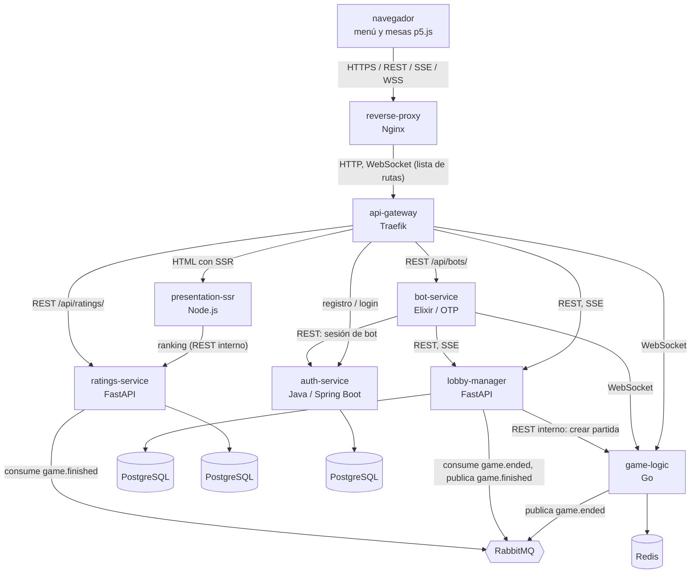

# Bololó (ArchSoft 1-F)

Juego de cartas con dos modos, construido como sistema distribuido:

- **Clásico** (`CLASSIC`): 5 rondas de tríos y cuartetos, 4 jugadores, por turnos. Pantalla `/ingame/`.
- **Camaleón** (`CHAMELEON`): en tiempo real, 2 a 4 jugadores; un repartidor tira cartas y gana quien reúne los 8 colores. Pantalla `/chameleon/`. Reglas: [game-logic/docs/MODO_CAMALEON.md](game-logic/docs/MODO_CAMALEON.md).

El modo se elige al crear la sala. Cada componente de la vista C&C tiene su propia carpeta, que se construye y despliega como un contenedor independiente (RNF-06, RNF-11).


```mermaid
flowchart TB
  C[navegador<br/>menú y mesas p5.js] -- "HTTPS / REST / SSE / WSS" --> RP[reverse-proxy<br/>Nginx]
  RP -- "HTTP, WebSocket (lista de rutas)" --> G[api-gateway<br/>Traefik]
  G -- "HTML con SSR" --> P[presentation-ssr<br/>Node.js]
  P -- "ranking (REST interno)" --> RS
  G -- "REST, SSE" --> L[lobby-manager<br/>FastAPI]
  G -- "registro / login" --> A[auth-service<br/>Java / Spring Boot]
  G -- WebSocket --> GL[game-logic<br/>Go]
  G -- "REST /api/bots/" --> B[bot-service<br/>Elixir / OTP]
  G -- "REST /api/ratings/" --> RS[ratings-service<br/>FastAPI]
  B -- "REST, SSE" --> L
  B -- WebSocket --> GL
  B -- "REST: sesión de bot" --> A
  L -- "REST interno: crear partida" --> GL
  GL -- "publica game.ended" --> MQ{{RabbitMQ}}
  L -- "consume game.ended, publica game.finished" --> MQ
  RS -- "consume game.finished" --> MQ
  L --> PG[(PostgreSQL)]
  RS --> RPG[(PostgreSQL)]
  A --> APG[(PostgreSQL)]
  GL --> R[(Redis)]
```

## Estructura

```
ArchSoft-Group1F/
├── presentation/        Assets y clientes web (p5.js)
├── presentation-ssr/    Servidor SSR de la presentación
│   ├── libraries/       p5 compartido por todas las pantallas
│   ├── lobby/           pantalla de ingreso y salas (elige el modo)
│   ├── game/            mesa del modo clásico (/ingame/)
│   └── chameleon/       mesa básica del modo camaleón (/chameleon/)
├── reverse-proxy/       Nginx: único punto de entrada, HTTPS en :443 y lista de rutas
├── api-gateway/         Traefik: enruta hacia los servicios, sin puertos publicados
├── auth-service/        Cuentas y credenciales en Java + Spring Boot
├── lobby-manager/       Gestión de sesiones y salas en FastAPI + PostgreSQL
├── game-logic/          Lógica de la partida, servicio Go y persistencia Redis
├── bot-service/         Bots que llenan salas y juegan solos, en Elixir/OTP
├── ratings-service/     Ranking de jugadores por eventos de RabbitMQ, en FastAPI + PostgreSQL
├── docs/                Documentación transversal del sistema
└── .github/workflows/   CI, un workflow por componente
```

Convenciones:

- Cada componente es autocontenido: su código, pruebas, `Dockerfile` y `README.md` viven en su carpeta.
- Cada base de datos pertenece a un solo componente: PostgreSQL al Auth, PostgreSQL al Lobby, PostgreSQL a Ratings y Redis a Game Logic. Su configuración va dentro de la carpeta del componente dueño.
- La documentación propia de un componente va en `<componente>/docs/`. En `docs/` solo va lo que cruza componentes.
- El `docker-compose.yml` que levante todo el sistema irá en la raíz cuando haya más de un servicio ejecutable.

## Componentes

| Carpeta | Estado | Cómo usarlo |
|---|---|---|
| [`presentation-ssr/`](presentation-ssr) | HTML inicial SSR y assets de la presentación | `docker compose up --build` y abrir `https://localhost`. El servicio `init` genera solo las claves y el certificado si faltan; confiar una vez en la CA: ver [docs/deployment.md](docs/deployment.md) |
| [`presentation/`](presentation) | Assets y clientes web (p5.js) | Reutilizados por `presentation-ssr` |
| [`auth-service/`](auth-service) | Emite todas las sesiones (invitados y cuentas, RS256), registro/login, Spring Security, BCrypt y bloqueo por intentos | Ver [auth-service/README.md](auth-service/README.md) |
| [`game-logic/`](game-logic) | Motor, API interna, WebSocket y persistencia Redis | Ver [game-logic/README.md](game-logic/README.md) |
| [`lobby-manager/`](lobby-manager) | Verifica las sesiones de Auth, jugadores, salas y tokens de partida | Ver [lobby-manager/README.md](lobby-manager/README.md) |
| [`bot-service/`](bot-service) | Llenar sala con bots que juegan la partida completa | Ver [bot-service/README.md](bot-service/README.md) y [docs/bot-service.md](docs/bot-service.md) |
| [`ratings-service/`](ratings-service) | Ranking Elo por modo, alimentado por RabbitMQ | Ver [ratings-service/README.md](ratings-service/README.md) y [docs/ratings-service.md](docs/ratings-service.md) |
| [`reverse-proxy/`](reverse-proxy) | Nginx: único punto de entrada; TLS 1.2/1.3 con HSTS en :443, :80 solo redirige ([escenario 1](docs/p3/esc1.md)); solo deja pasar las rutas públicas ([escenario 2](docs/p3/esc2.md)) | Ver su README |
| [`api-gateway/`](api-gateway) | Traefik: enrutamiento por ruta hacia los servicios; sin puertos publicados, solo lo alcanza el proxy | Ver su README |
