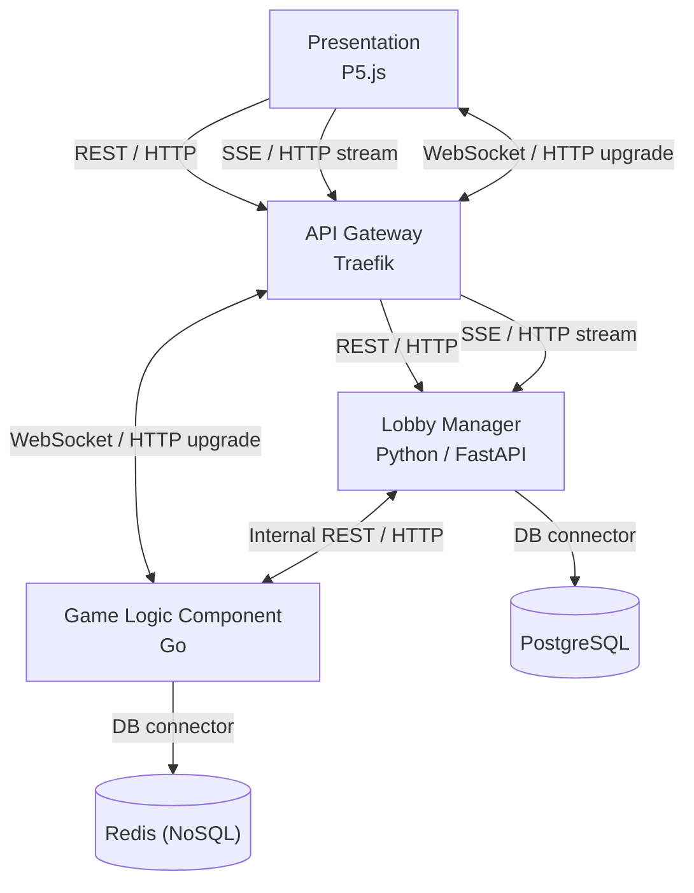
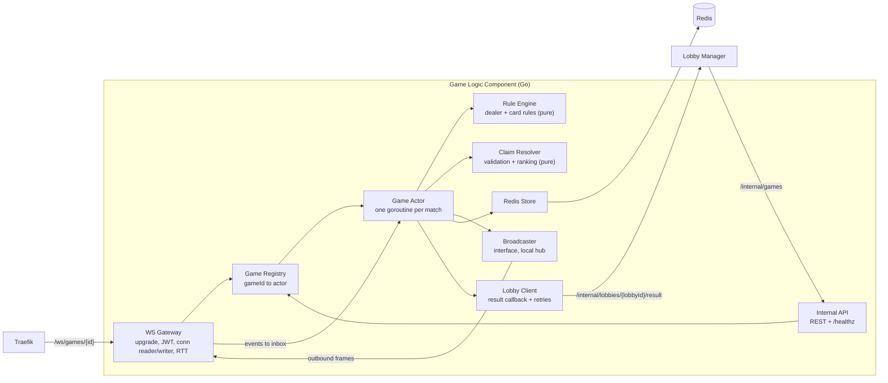
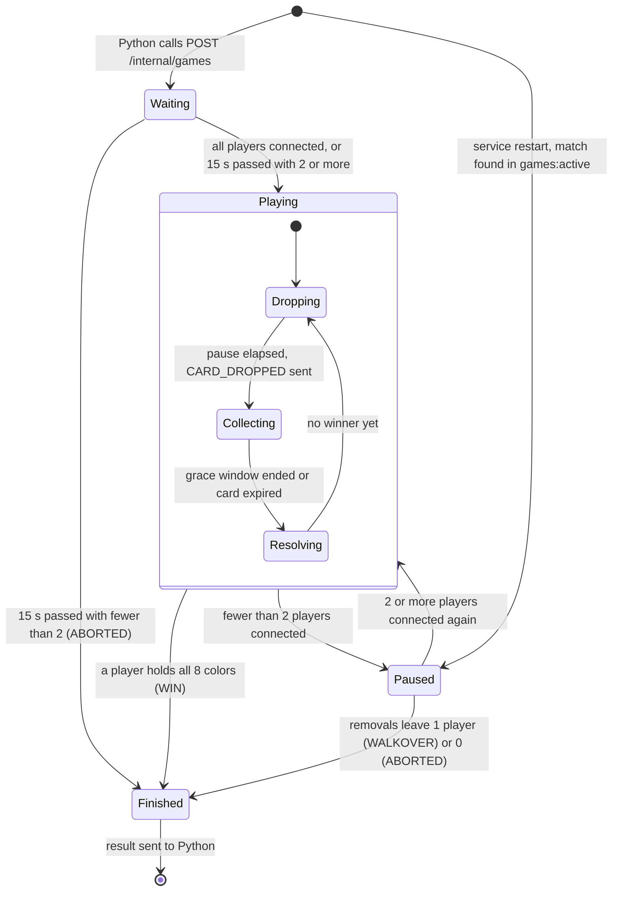
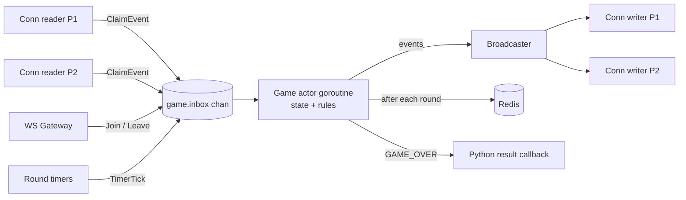
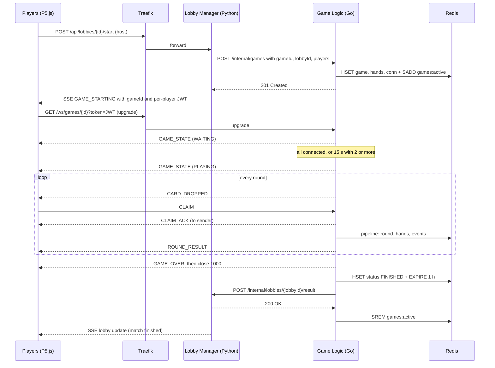
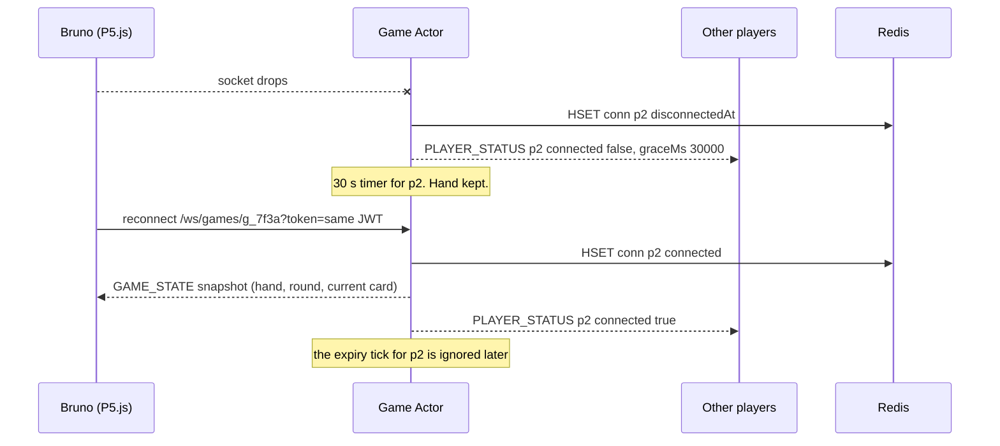
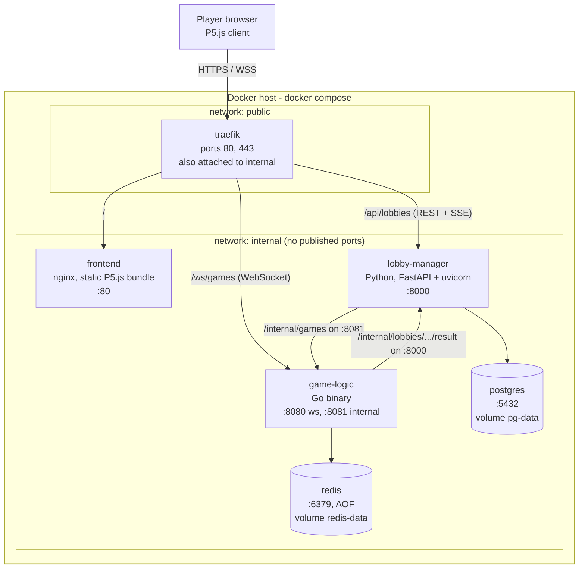

# Bololó - Game Logic Component Design (Go + Redis)

| | |
|---|---|
| Component | Game Logic Component |
| Technology | Go (Golang), Redis |
| Views covered | Component-and-Connector (C&C), Deployment |
| Status | Design, version 1.0 (October 2026) |

## Contents

1. [Purpose and scope](#1-purpose-and-scope)
2. [C&C view](#2-cc-view)
3. [Domain model and rule engine](#3-domain-model-and-rule-engine)
4. [Game lifecycle and round timing](#4-game-lifecycle-and-round-timing)
5. [Fair claim resolution](#5-fair-claim-resolution)
6. [Concurrency model](#6-concurrency-model)
7. [Interface contracts](#7-interface-contracts)
8. [Redis data model, recovery and reconnection](#8-redis-data-model-recovery-and-reconnection)
9. [Deployment view](#9-deployment-view)
10. [End-to-end walkthrough](#10-end-to-end-walkthrough)
11. [Tunable values](#11-tunable-values)
12. [Risks](#12-risks)
13. [Scaling path](#13-scaling-path)
14. [Requirements traceability](#14-requirements-traceability)

---

## 1. Purpose and scope

Bololó is a real-time multiplayer card game. An automated dealer drops one random card per round at a random spot on a shared table, and every player in the match races to grab it. A player wins by holding all 8 colors with no repeats. Winning a color you already hold makes you lose both copies, and grabbing the special **Chameleon** card wipes your whole hand.

This document designs the **Game Logic Component**, the Go service that runs a match from the moment the Lobby Manager hands it off until there is a winner. Go was chosen because many players hit the same card within milliseconds of each other, and goroutines plus channels make that concurrency easy to reason about.

### 1.1 Responsibility boundary

| Concern | Lobby Manager (Python / FastAPI) | Game Logic (Go) |
|---|---|---|
| Create lobby, list available games, join, wait for start | Yes | No |
| Lobby updates to waiting players (SSE) | Yes | No |
| Player identity, issuing the in-game token (JWT) | Yes | Validates only |
| Dealing cards, timing rounds, speed-up | No | Yes |
| Receiving and judging claims | No | Yes |
| Applying card rules, detecting the winner | No | Yes |
| Disconnects and reconnects during the match | No | Yes |
| Persisting match state | PostgreSQL (lobbies, users, results history) | Redis (live match state) |
| Closing or resetting the lobby after the match | Yes, when Go reports the result | Reports `{lobbyId, winnerId}` |

**Rule of thumb:** Python owns everything *before* and *after* a match. Go owns everything *during* a match. Python never runs game logic, and Go never manages lobbies.

### 1.2 Assumptions

These are design choices, not requirements, and are easy to change (see [Tunable values](#11-tunable-values)).

- **A1.** A match starts when every player on the roster has connected, or 15 s after creation if at least 2 have. If fewer than 2 have connected after 15 s, the match is aborted.
- **A2.** If disconnect removals leave only one player, that player wins by default (*walkover*). If none are left, the match is aborted.
- **A3.** No new card drops while fewer than 2 players are connected. The match pauses until someone reconnects or is removed.
- **A4.** A single Go instance runs all matches. Game state lives in memory and is persisted to Redis.
- **A5.** Deployment uses Docker Compose on one host.
- **A6.** The table has a fixed aspect ratio (16:9) on every client, so normalized coordinates (0..1) mean the same spot for everyone.
- **A7.** Card types are visible when dropped. Players may choose *not* to grab a card (for example a Chameleon or a duplicate), which is part of the strategy.

### 1.3 Out of scope

- Lobby features (creation, listing, joining, chat), user accounts and login. These belong to the Lobby Manager.
- P5.js rendering and UI.
- Spectators, replays UI and leaderboards. The Redis event stream makes them possible later.
- Running several Go instances. The design leaves a path for it ([Scaling path](#13-scaling-path)).

### 1.4 Glossary

| Term | Meaning |
|---|---|
| Match / game | One play session for one lobby, identified by `gameId`. |
| Round | One card drop, numbered 1, 2, 3, ... |
| Drop | The dealer placing a card at a random (x, y) on the table. |
| Claim | A player's click on the dropped card, sent as a `CLAIM` message. |
| Grace window | The 400 ms after the first valid claim during which other claims can still compete. |
| Reaction time | Milliseconds from the card appearing on a client's screen to that player's click, as reported by the client. |
| RTT | Round-trip time between the server and one client, measured with `PING`/`PONG`. |
| Effective time | The reaction time the server actually uses to rank claims (see [5.4](#54-effective-time)). |
| Speed level | A counter that grows with match duration and shortens round timings. |
| Hand mask | An 8-bit number, one bit per color, describing a player's hand. |
| Actor | A goroutine that exclusively owns one match's state and processes its events one by one. |
| Walkover | A win because every other player was removed. |

---

## 2. C&C view

### 2.1 System view

Based on the project's C&C diagram:



### 2.2 Components

| Component | Technology | Responsibility |
|---|---|---|
| Presentation | P5.js | Draws lobbies and the game table. Measures reaction time and sends claims. |
| API Gateway | Traefik | Single public entry point. TLS, routing by path, WebSocket upgrade passthrough. |
| Lobby Manager | Python, FastAPI | Lobby lifecycle before and after a match. Issues player tokens. Starts matches in Go and receives results. |
| Game Logic Component | Go | Runs matches: dealing, claims, rules, timing, reconnects, result reporting. |
| PostgreSQL | Relational DB | Lobbies, users, match history. Used only by the Lobby Manager. |
| Redis | In-memory NoSQL with AOF persistence | Live match state, audit event stream. Used only by Game Logic. |

### 2.3 Connectors

| Connector | From → To | Protocol | Purpose |
|---|---|---|---|
| Lobby REST | P5.js → Traefik → Lobby Manager | HTTP REST (`/api/lobbies/...`) | Create, list and join lobbies. Start a match. |
| Lobby events | Lobby Manager → Traefik → P5.js | SSE (HTTP stream) | Lobby updates, and the "match starting" event carrying the `gameId` and the player's token. |
| Game channel | P5.js ↔ Traefik ↔ Game Logic | WebSocket (HTTP upgrade, `/ws/games/{id}`) | Bidirectional, low-latency in-game messages. |
| Match handoff | Lobby Manager → Game Logic | Internal REST (`POST /internal/games`) | Hands a lobby's roster to Go to start a match. |
| Result callback | Game Logic → Lobby Manager | Internal REST (`POST /internal/lobbies/{lobbyId}/result`) | Reports the winner so Python can close or reset the lobby. |
| Lobby DB | Lobby Manager → PostgreSQL | SQL driver | Persistence of lobbies and history. |
| Game DB | Game Logic → Redis | RESP (Redis protocol, `go-redis`) | Persistence of live match state and event log. |

The internal REST connectors are **not** routed through Traefik. They run only on the private Docker network ([Deployment view](#9-deployment-view)).

### 2.4 Inside the Game Logic Component



| Module | Responsibility | Concurrency |
|---|---|---|
| Internal API | `POST /internal/games`, `GET /internal/games/{id}`, `GET /healthz`. Checks the service secret. | Standard `net/http` handlers. |
| WS Gateway | Validates the JWT, upgrades the connection, runs one reader and one writer goroutine per connection, measures RTT, stamps claims with their arrival time. | 2 goroutines per connection. |
| Game Registry | Map from `gameId` to its actor. Creates actors, looks them up, removes finished ones, restores active matches at startup. | `sync.RWMutex` around the map only. |
| Game Actor | Owns all state of one match: players, hands, round, timers, speed level. Runs the state machine. | 1 goroutine per match. Only it touches match state. |
| Rule Engine | Draws random cards and positions. `Apply` and `IsWinner` on hand masks. | Pure functions, no shared state. |
| Claim Resolver | Validates claims, computes effective time, picks the round winner. | Pure functions. |
| Broadcaster | Sends a message to all players of a match, or to one player. Local implementation is an in-process hub. | Non-blocking sends to per-connection buffers. |
| Redis Store | Writes match state after each change, loads it at startup. | Called from the actor. |
| Lobby Client | Calls the Lobby Manager's result endpoint with retries. | Own goroutine per pending callback. |

Suggested Go package layout:

```text
cmd/gamelogic/main.go     wiring, config, startup recovery
internal/api              internal REST handlers
internal/ws               gateway, connection reader/writer, RTT
internal/game             registry, actor, state machine, timing
internal/rules            cards, dealer, Apply / IsWinner
internal/claims           validation, effective time, ranking
internal/broadcast        Broadcaster interface, local hub
internal/store            Redis store (go-redis)
internal/lobby            result callback client
```

---

## 3. Domain model and rule engine

### 3.1 Cards

There are 9 card types. The dealer picks one **uniformly at random**, so each has probability **1/9 (≈ 11.1 %)**. Draws are independent (an infinite deck), so the same type can appear several rounds in a row.

| Index | Card | Hand bit |
|---|---|---|
| 0 | RED | `0x01` |
| 1 | ORANGE | `0x02` |
| 2 | YELLOW | `0x04` |
| 3 | GREEN | `0x08` |
| 4 | CYAN | `0x10` |
| 5 | BLUE | `0x20` |
| 6 | PURPLE | `0x40` |
| 7 | PINK | `0x80` |
| 8 | CHAMELEON | none |

Each match gets its own random source (`math/rand/v2`, seeded from `crypto/rand`). The dealer draws `IntN(9)` for the type. The card center is drawn uniformly so the whole card stays on the table: `x ∈ [CARD_W/2, 1 − CARD_W/2]`, `y ∈ [CARD_H/2, 1 − CARD_H/2]`, with `CARD_W = 0.08` and `CARD_H = 0.12` in normalized table units.

### 3.2 Hand

A hand can hold at most one card of each color (a second copy is never kept, see the rules), so it is fully described by an 8-bit mask. The empty hand is `0x00`, and a winning hand is `0xFF`.

On the wire, hands are sent as color names (`["RED","BLUE"]`) so clients don't need to decode bits. In Redis they are stored as the mask.

### 3.3 Rule engine

The rules are a pure function: no I/O, no clock, no shared state. This makes them trivial to unit-test and safe to call from the actor.

```go
type Outcome string

const (
    Added         Outcome = "ADDED"
    DuplicateLost Outcome = "DUPLICATE_LOST"
    ChameleonWipe Outcome = "CHAMELEON_WIPE"
)

type Card struct {
    Chameleon bool
    Color     uint8 // 0..7, ignored when Chameleon
}

// Apply returns the new hand after the player wins card c.
func Apply(hand uint8, c Card) (uint8, Outcome) {
    if c.Chameleon {
        return 0, ChameleonWipe // lose every card
    }
    bit := uint8(1) << c.Color
    if hand&bit != 0 {
        return hand &^ bit, DuplicateLost // lose the new card and the one already held
    }
    return hand | bit, Added
}

func IsWinner(hand uint8) bool { return hand == 0xFF }
```

### 3.4 Rule table

| Card won | Player already holds that color? | Outcome | Effect on hand |
|---|---|---|---|
| Color C | No | `ADDED` | C is added. |
| Color C | Yes | `DUPLICATE_LOST` | Both copies of C are lost, so C is removed. |
| Chameleon | n/a | `CHAMELEON_WIPE` | All cards are lost. Hand becomes empty. |

After `ADDED`, the actor checks `IsWinner`. Only `ADDED` can produce a win.

### 3.5 Test cases

| # | Hand before | Card | Expected outcome | Hand after | Winner? |
|---|---|---|---|---|---|
| 1 | empty `0x00` | RED | `ADDED` | `0x01` {RED} | No |
| 2 | {RED, BLUE} `0x21` | BLUE | `DUPLICATE_LOST` | `0x01` {RED} | No |
| 3 | {RED} `0x01` | RED | `DUPLICATE_LOST` | `0x00` empty | No |
| 4 | 7 colors, no PINK `0x7F` | CHAMELEON | `CHAMELEON_WIPE` | `0x00` | No |
| 5 | empty `0x00` | CHAMELEON | `CHAMELEON_WIPE` | `0x00` | No |
| 6 | 7 colors, no PINK `0x7F` | PINK | `ADDED` | `0xFF` | **Yes** |
| 7 | 7 colors, no PINK `0x7F` | RED | `DUPLICATE_LOST` | `0x7E` | No |
| 8 | full `0xFF` (pure-function check only) | CHAMELEON | `CHAMELEON_WIPE` | `0x00` | No |

Case 8 can't happen during play because the match ends as soon as a hand reaches `0xFF`. It is still a valid unit test of the pure function.

---

## 4. Game lifecycle and round timing

### 4.1 State machine



| State | What happens | Redis `status` |
|---|---|---|
| Waiting | Players connect. Each one gets a `GAME_STATE` snapshot. `PLAYER_STATUS` is broadcast. | `WAITING` |
| Playing / Dropping | A pause timer runs. No card is on the table. | `PLAYING` |
| Playing / Collecting | A card is on the table. Claims are validated and collected. | `PLAYING` |
| Playing / Resolving | Instantaneous: rank claims, apply the rule, persist, broadcast `ROUND_RESULT`. | `PLAYING` |
| Paused | Fewer than 2 players connected. The current round finishes normally, but no new card drops. | `PLAYING` |
| Finished | `GAME_OVER` is broadcast, sockets close, the result is sent to Python. | `FINISHED` |

`endReason` is one of `WIN`, `WALKOVER` or `ABORTED`.

### 4.2 One round

1. **Dropping.** The actor waits `interval(level)`. Then it draws a card and position, records `droppedAt` (monotonic clock), increments `round` and broadcasts `CARD_DROPPED` with `expiresInMs = cardTtl(level)`.
2. **Collecting.** Claims arrive. The first *valid* claim sets `closeAt = firstClaimReceivedAt + 400 ms`. Later valid claims are accepted until `closeAt`.
3. **Hard deadline.** If nobody claims, the round closes at `droppedAt + cardTtl + 400 ms`. Clients hide the card after `cardTtl`. The extra 400 ms lets claims that were already on their way still arrive. Claims received after the round closes are rejected with `ROUND_CLOSED`.
4. **Resolving.** The fastest valid claim (see [section 5](#5-fair-claim-resolution)) wins. The actor applies the rule, checks for a winner, writes Redis and broadcasts `ROUND_RESULT`. With no valid claims, the card is discarded (`winnerId: null`).
5. Back to **Dropping**, or to **Finished** if there is a winner.

The two close conditions are implemented as two timers posting `TimerTick` events. Whichever arrives first resolves the round, and the actor ignores the other one because its round number is already resolved.

### 4.3 Speed-up

The longer a match runs, the faster cards come.

```text
elapsed   = now - startedAt
level     = floor(elapsed / 60 s)
interval  = max(600 ms,  2500 ms × 0.85^level)   pause between rounds
cardTtl   = max(1500 ms, 4000 ms × 0.90^level)   time a card stays on the table
grace     = 400 ms (fixed, so fairness never degrades)
```

The level is evaluated each time the actor schedules a drop. When it differs from the previous one, the actor broadcasts `SPEED_UP` right before the next `CARD_DROPPED`.

| Level | Elapsed | Pause between drops | Card on table |
|---|---|---|---|
| 0 | 0:00 - 0:59 | 2500 ms | 4000 ms |
| 1 | 1:00 - 1:59 | 2125 ms | 3600 ms |
| 2 | 2:00 - 2:59 | 1806 ms | 3240 ms |
| 3 | 3:00 - 3:59 | 1535 ms | 2916 ms |
| 4 | 4:00 - 4:59 | 1305 ms | 2624 ms |
| 5 | 5:00 - 5:59 | 1109 ms | 2362 ms |
| 6 | 6:00 - 6:59 | 943 ms | 2126 ms |

The pause reaches its 600 ms floor at level 9, and the card time reaches its 1500 ms floor at level 10. With a typical claim around 300 ms, a round takes about 2500 + 300 + 400 ≈ 3.2 s at level 0 (about 19 cards per minute) and about 943 + 300 + 400 ≈ 1.6 s at level 6 (about 36 cards per minute).

### 4.4 Worked timelines (level 0)

**A. Nobody claims.** t = 0 is when the previous round resolved.

| t (ms) | Event |
|---|---|
| 0 | Previous `ROUND_RESULT` sent. Pause timer set for 2500 ms. |
| 2500 | Round n: `CARD_DROPPED` with `expiresInMs: 4000`. Hard-deadline tick set for 2500 + 4000 + 400 = 6900. |
| ≈ 6500 | Clients hide the card. |
| 6900 | Hard-deadline tick. No candidates, so the card is discarded. `ROUND_RESULT {winnerId: null}`. Persist. |
| 9400 | Round n+1 drops. |

**B. One claim.** t = 0 is the drop.

| t (ms) | Event |
|---|---|
| 0 | `CARD_DROPPED` (GREEN). Hard-deadline tick at 4400. |
| 293 | Ana's claim arrives. Valid and first, so `closeAt = 693`. `CLAIM_ACK {accepted: true}` to Ana. |
| 693 | Close tick. Ana wins GREEN, outcome `ADDED`. Persist and broadcast `ROUND_RESULT`. Pause timer 2500 ms. |
| 3193 | Next drop. |
| 4400 | Stale hard-deadline tick for round n arrives and is ignored. |

**C. Several claims inside the grace window.** Effective times come from [5.6](#56-worked-examples).

| t (ms) | Event |
|---|---|
| 0 | `CARD_DROPPED` (BLUE). |
| 293 | Ana: valid, effective 250 ms. First claim, so `closeAt = 693`. |
| 350 | Ana again: rejected, `ALREADY_CLAIMED`. |
| 400 | Bruno: valid, effective 260 ms. |
| 455 | Carla: valid, effective 230 ms. |
| 693 | Close tick. Ranking: Carla 230 < Ana 250 < Bruno 260. **Carla wins.** |
| 720 | Dan: rejected, `ROUND_CLOSED`. |

---

## 5. Fair claim resolution

The winner is the player with the fastest **reaction**, not the one whose packet arrived first. Otherwise players far from the server could never win. Since the reaction time comes from the client, the server checks it against its own measurement.

### 5.1 What the client measures

The client records `performance.now()` in the frame where it first draws the card and again in `mousePressed()`. `reactionMs` is the difference, rounded to an integer. Frame timing adds at most one frame (≈ 16 ms) of error, which is the same for everybody.

### 5.2 Validation

A claim is rejected (with the reason sent back in `CLAIM_ACK`) if:

| Check | Reason code |
|---|---|
| The `round` in the claim is not the round currently on the table. | `WRONG_ROUND` (or `ROUND_CLOSED` if it is the round that just resolved) |
| The player already claimed this round. Only one claim per player per round counts. | `ALREADY_CLAIMED` |
| The click is outside the card: `|clickX − x| > CARD_W/2 + 0.02` or `|clickY − y| > CARD_H/2 + 0.02`. | `MISS` |
| `reactionMs < 120`. That is faster than human reaction, so it is not believable. | `TOO_FAST` |
| The message is malformed, or `reactionMs` is larger than the card's time on the table. | `INVALID` |

A rejected claim still counts as the player's one claim for that round. This stops a player from spamming clicks until one lands inside the card.

### 5.3 Measuring RTT

The writer goroutine of each connection sends `PING {t}` every 2 s, where `t` is the server's monotonic time in ms. The client echoes `PONG {t}` immediately. The reader goroutine computes `sample = now − t` and keeps a smoothed value:

```text
rtt = 0.8 × rtt + 0.2 × sample        (EWMA, alpha = 0.2)
```

The first sample initializes `rtt`. The RTT belongs to the connection, so only that connection's reader goroutine ever touches it.

### 5.4 Effective time

The time from the server sending the card to receiving the claim is: half the RTT for the card to travel, plus the reaction, plus half the RTT for the claim to travel. So the server can estimate the reaction on its own:

```text
serverEstimate = (claimReceivedAt − droppedAt) − rtt
effective      = max(reactionMs, serverEstimate − 80 ms)
```

- An honest client reports roughly the server estimate, and the 80 ms tolerance absorbs network jitter. The reported value is used.
- A client that reports a fake low time gets clamped up to `serverEstimate − 80 ms`. Cheating can gain at most about 80 ms, never more.
- A slow network doesn't hurt an honest player, because their RTT is subtracted.

```go
func Effective(c Claim, droppedAt time.Time) time.Duration {
    est := c.ReceivedAt.Sub(droppedAt) - c.RTT
    return max(c.Reported, est-RTTTolerance) // RTTTolerance = 80 ms
}
```

### 5.5 Picking the winner

Candidates are sorted by:

1. lowest `effective`
2. then earliest `receivedAt` (arrived at the server first)
3. then lowest actor sequence number (the order the actor dequeued them, always unique)

The first candidate wins. Rule 3 makes the result fully deterministic.

### 5.6 Worked examples

All times are in ms. `elapsed` = `claimReceivedAt − droppedAt`.

**Example 1: honest fast player vs honest slower player.**

| Player | RTT | Real reaction | Reported | Elapsed | Server estimate | Estimate − 80 | Effective |
|---|---|---|---|---|---|---|---|
| Ana | 40 | 250 | 250 | 293 | 253 | 173 | **250** |
| Eva | 50 | 320 | 320 | 372 | 322 | 242 | 320 |

Ana wins. Both reports are believable, so the reported values are used.

**Example 2: a player faking a low time.**

| Player | RTT | Real reaction | Reported | Elapsed | Server estimate | Estimate − 80 | Effective |
|---|---|---|---|---|---|---|---|
| Ana | 40 | 250 | 250 | 293 | 253 | 173 | **250** |
| Bruno | 60 | 340 | 130 (fake) | 400 | 340 | 260 | 260 |

Ana wins. Bruno's fake 130 ms passes the 120 ms floor, but the server clamps it up to 260 ms. Had Bruno's real reaction been 320 ms, cheating would take him from 320 to 240 and he would beat Ana. That is the bounded 80 ms advantage discussed in [Risks](#12-risks).

**Example 3: a player with high latency.**

| Player | RTT | Real reaction | Reported | Elapsed | Server estimate | Estimate − 80 | Effective |
|---|---|---|---|---|---|---|---|
| Ana | 40 | 250 | 250 | 293 | 253 | 173 | 250 |
| Carla | 220 | 230 | 230 | 455 | 235 | 155 | **230** |

Carla wins even though her claim arrived 162 ms after Ana's. Ranking by arrival order would have given the card to Ana. Carla's claim is still inside the grace window (`closeAt = 293 + 400 = 693`). A player whose RTT is so high that the claim arrives after the window closes cannot win that round, which is the price of keeping rounds short.

Timeline C in [4.4](#44-worked-timelines-level-0) combines all of these players in one round.

---

## 6. Concurrency model

### 6.1 Goroutines

| Goroutine | Count | Owns |
|---|---|---|
| Game actor | 1 per match | All match state: roster, hands, round, timers, level. |
| Connection reader | 1 per connection | Reading frames, RTT estimate, stamping `receivedAt`. |
| Connection writer | 1 per connection | Writing frames from the `send` buffer, sending `PING`. |
| Timer callbacks | short-lived | Post a `TimerTick` into the actor's inbox and exit. |
| Lobby callback | 1 per finished match | Retrying the result callback. |
| HTTP handlers | per request | Internal REST. |



### 6.2 The game actor

Each match is an actor: a single goroutine that owns its state and processes events from one buffered channel (`inbox`, capacity 256), one at a time.

```go
type Event interface{}           // JoinEvent | LeaveEvent | ClaimEvent | TimerTick

type ClaimEvent struct {
    PlayerID   string
    Round      int
    Reported   time.Duration     // reactionMs from the client
    X, Y       float64
    ReceivedAt time.Time         // stamped by the reader before parsing
    RTT        time.Duration     // reader's current EWMA
}

func (g *Game) run(ctx context.Context) {
    for {
        select {
        case ev := <-g.inbox:
            g.seq++                          // unique processing order
            switch e := ev.(type) {
            case JoinEvent:  g.onJoin(e)
            case LeaveEvent: g.onLeave(e)
            case ClaimEvent: g.onClaim(e, g.seq)
            case TimerTick:  g.onTick(e)     // stale ticks (old round) are ignored
            }
            if g.status == Finished {
                g.shutdown()                 // close sockets, start callback, deregister
                return
            }
        case <-ctx.Done():
            return
        }
    }
}
```

Timers never touch state. `time.AfterFunc` only posts a `TimerTick{Kind, Round}` into the inbox (using a `select` on the actor's done channel, so it can't block after the match ends).

### 6.3 Connections and slow clients

- The **reader** reads a frame, stamps `receivedAt = time.Now()` *before* parsing, then handles it. `PONG` updates the RTT locally. `CLAIM` becomes a `ClaimEvent` with the current RTT and is sent to the inbox. If the socket closes, the reader sends a `LeaveEvent`.
- The **writer** drains a buffered `send` channel (capacity 32 frames) and sends `PING` every 2 s. Each write has a 5 s deadline.
- The **Broadcaster** encodes each message to JSON once and does a non-blocking send of the same bytes into every recipient's `send` channel. If a buffer is full, that client can't keep up. It is closed with code `4008` instead of making the actor wait. The player then gets the normal 30 s reconnect grace.

```go
type Broadcaster interface {
    Publish(gameID string, msg any)                  // all players of the match
    SendTo(gameID, playerID string, msg any)         // one player
}
```

The local implementation is a hub: `map[gameID]map[playerID]*Conn` guarded by an `RWMutex`. The WS Gateway registers a connection in the hub before sending its `JoinEvent`. That mutex protects only the connection map, never match state.

All durations use Go's monotonic clock reading (`time.Now()` / `Sub`), so wall-clock adjustments can't distort reaction times.

### 6.4 Why no locks on game state

- Only the actor goroutine reads or writes a match's state. Nothing else holds a pointer to it.
- Everything else communicates with the actor by sending a message on its channel. Go channels give a happens-before guarantee, so the actor always sees complete event data.
- Because events are processed one at a time, a claim always sees a consistent state (current round, who already claimed, whether the window is open). Two claims can never both "win" or interleave halfway through a rule.
- Pure modules (Rule Engine, Claim Resolver) have no state to protect.

The cut-off between "claim accepted" and "round closed" is the order in which the actor dequeues events. A claim stamped a few microseconds before `closeAt` but queued behind the close tick is rejected. That skew is far below anything a human can notice.

### 6.5 Walkthrough: three claims within 50 ms

The card for round 12 dropped at t = 0. P1, P2 and P3 click almost at the same time.

1. **t = 410.** P1's reader reads the frame, stamps `receivedAt = 410`, parses the `CLAIM`, attaches `rtt = 60` and sends a `ClaimEvent` to the inbox. The actor dequeues it as `seq 101`.
2. The actor validates: round 12 is open, P1 hasn't claimed, the click hits the card, the reported 330 ms is ≥ 120 ms. It records P1 as claimed and adds the candidate with effective `max(330, (410 − 60) − 80) = 330`. This is the first valid claim, so `closeAt = 810` and a close tick is scheduled. `CLAIM_ACK {accepted: true}` goes to P1 only.
3. **t = 425.** P2's reader does the same at the same moment P3's reader is still parsing. Both readers may try to send at once. The channel orders them. P2 lands first (`seq 102`): `rtt = 30`, reported 340, effective `max(340, 395 − 80) = 340`. Added. Ack sent.
4. **t = 452.** P3 (`seq 103`): `rtt = 140`, reported 300, effective `max(300, 312 − 80) = 300`. Added. Ack sent.
5. **t = 455.** P3 double-clicks. `seq 104` is rejected with `ALREADY_CLAIMED` because P3 is already marked for round 12.
6. **t = 810.** The close tick is dequeued. The actor sorts the candidates: P3 300 < P1 330 < P2 340. P3 wins. `Apply` runs on P3's hand, the actor checks `IsWinner`, writes Redis in one pipeline and broadcasts `ROUND_RESULT`.
7. A claim from P4 dequeued after step 6 finds the round already resolved and gets `ROUND_CLOSED`.

At no point did two goroutines touch the round's state. The only shared object was the inbox channel, and it decided the processing order.

---

## 7. Interface contracts

### 7.1 Match sequence



The `/api/lobbies/...` start endpoint and the `GAME_STARTING` SSE event belong to the Lobby Manager. Their exact shape is defined by that team. Go only depends on the internal endpoints below.

### 7.2 Internal REST API (Go)

Served on Go's internal port (8081). Not routed by Traefik. Every request must carry `X-Service-Token: <SERVICE_SECRET>`, otherwise the response is `401`.

**`POST /internal/games`**: start a match.

```json
{
  "gameId": "g_7f3a",
  "lobbyId": "l_42",
  "players": [
    { "id": "p1", "name": "Ana" },
    { "id": "p2", "name": "Bruno" },
    { "id": "p3", "name": "Carla" }
  ]
}
```

| Status | When | Body |
|---|---|---|
| `201 Created` | Match created, in `WAITING`. | `{"gameId":"g_7f3a","status":"WAITING","wsPath":"/ws/games/g_7f3a"}` |
| `200 OK` | Same `gameId` already exists for the same `lobbyId`, so a retry is safe. | Same as above, with the current status. |
| `400 Bad Request` | Missing fields, fewer than 2 players, duplicate player ids. | `{"error":"..."}` |
| `401 Unauthorized` | Missing or wrong service token. | `{"error":"unauthorized"}` |
| `409 Conflict` | `gameId` exists for a different `lobbyId`. | `{"error":"game exists"}` |

**`GET /internal/games/{id}`**: match status, for Python and for debugging.

```json
{
  "gameId": "g_7f3a",
  "lobbyId": "l_42",
  "status": "PLAYING",
  "round": 57,
  "level": 2,
  "startedAt": 1791380000000,
  "players": [
    { "id": "p1", "connected": true,  "handSize": 5 },
    { "id": "p2", "connected": false, "handSize": 2 }
  ],
  "winnerId": null,
  "endReason": null
}
```

Returns `404` if the match is unknown or has expired from Redis.

**`GET /healthz`**: `200 {"status":"ok","redis":"ok"}`, or `503` if Redis doesn't answer `PING`. No service token required, since it reveals nothing.

### 7.3 Player token (JWT)

The Lobby Manager signs one token per player when the match starts and delivers it over the player's SSE stream. Go verifies it with the shared `JWT_SECRET`.

| Item | Value |
|---|---|
| Algorithm | HS256 (any other `alg` is rejected) |
| Claims | `gameId`, `playerId`, `exp` (and `iat`) |
| Lifetime | `exp = iat + 2 h`, long enough to reconnect at any time during the match |

```json
{ "gameId": "g_7f3a", "playerId": "p1", "iat": 1791379990, "exp": 1791387190 }
```

Go accepts the upgrade only if the signature and `exp` are valid, `gameId` matches the path, `playerId` is on the roster, and that player hasn't been removed. Otherwise it answers `401` or `403` before upgrading. It also checks the `Origin` header against `ALLOWED_ORIGINS`.

### 7.4 WebSocket connection

`GET /ws/games/{gameId}?token=<JWT>` (through Traefik, `wss://` in production). Browsers can't set custom headers on a WebSocket handshake, which is why the token is in the query string.

All frames are JSON text with a `type` field. Coordinates are normalized to 0..1 of the table width and height.

If the same player opens a second connection, the newer one wins and the older one is closed with `4001`.

| Close code | Meaning |
|---|---|
| `1000` | Match finished normally. |
| `4001` | Replaced by a newer connection of the same player. |
| `4003` | Player removed (reconnect grace expired). Don't reconnect. |
| `4008` | Slow consumer, the send buffer overflowed. The client may reconnect. |

### 7.5 Message catalog

**Client → server**

| Type | Fields | Example |
|---|---|---|
| `CLAIM` | `round`, `reactionMs`, `x`, `y` | `{"type":"CLAIM","round":18,"reactionMs":284,"x":0.312,"y":0.575}` |
| `PONG` | `t` (echoed from `PING`) | `{"type":"PONG","t":5123004}` |

**Server → client**

`GAME_STATE`: full snapshot. Sent to a player when they connect or reconnect, and to everyone when the match starts.

```json
{
  "type": "GAME_STATE",
  "gameId": "g_7f3a",
  "status": "PLAYING",
  "you": "p1",
  "round": 17,
  "level": 1,
  "intervalMs": 2125,
  "cardTtlMs": 3600,
  "players": [
    { "id": "p1", "name": "Ana",   "connected": true,  "hand": ["RED", "BLUE"] },
    { "id": "p2", "name": "Bruno", "connected": false, "hand": ["GREEN"] }
  ],
  "card": {
    "round": 17,
    "card": { "type": "COLOR", "color": "GREEN" },
    "x": 0.42, "y": 0.67,
    "expiresInMs": 1800
  }
}
```

`card` is `null` when no card is on the table.

`CARD_DROPPED`: a new card is on the table.

```json
{ "type": "CARD_DROPPED", "round": 18, "card": { "type": "COLOR", "color": "BLUE" }, "x": 0.31, "y": 0.58, "expiresInMs": 3600 }
```

A Chameleon is `"card": { "type": "CHAMELEON" }`.

`CLAIM_ACK`: sent only to the claiming player. `accepted: true` means "valid and competing", not "won".

```json
{ "type": "CLAIM_ACK", "round": 18, "accepted": true,  "reason": null }
{ "type": "CLAIM_ACK", "round": 18, "accepted": false, "reason": "MISS" }
```

Reasons: `WRONG_ROUND`, `ROUND_CLOSED`, `ALREADY_CLAIMED`, `MISS`, `TOO_FAST`, `INVALID`.

`ROUND_RESULT`: the round is resolved. `hands` lists every player still in the match.

```json
{
  "type": "ROUND_RESULT",
  "round": 18,
  "winnerId": "p3",
  "card": { "type": "COLOR", "color": "BLUE" },
  "outcome": "DUPLICATE_LOST",
  "effectiveMs": 230,
  "hands": { "p1": ["RED"], "p2": ["GREEN"], "p3": ["GREEN", "PINK"] }
}
```

With no winner: `"winnerId": null, "outcome": null, "effectiveMs": null`.

`PLAYER_STATUS`: someone connected, disconnected or was removed.

```json
{ "type": "PLAYER_STATUS", "playerId": "p2", "connected": false, "removed": false, "graceMs": 30000 }
```

`SPEED_UP`: the speed level changed. Sent right before the next `CARD_DROPPED`.

```json
{ "type": "SPEED_UP", "level": 2, "intervalMs": 1806, "cardTtlMs": 3240 }
```

`GAME_OVER`: the match ended. The server closes the socket with `1000` right after.

```json
{ "type": "GAME_OVER", "winnerId": "p3", "endReason": "WIN", "rounds": 143, "durationMs": 512340 }
```

`PING`: RTT probe every 2 s. The client must answer with `PONG` carrying the same `t`.

```json
{ "type": "PING", "t": 5123004 }
```

### 7.6 Result callback (Go → Python)

`POST {LOBBY_CALLBACK_URL}/internal/lobbies/{lobbyId}/result` with header `X-Service-Token`.

```json
{ "gameId": "g_7f3a", "winnerId": "p3", "endReason": "WIN", "rounds": 143, "durationMs": 512340 }
```

`winnerId` is `null` when `endReason` is `ABORTED`.

- Python must treat it as **idempotent** by `gameId`, because Go may send it more than once.
- Any `2xx` is success. On a network error or `5xx`, Go retries with exponential backoff: 1 s, 2 s, 4 s, 8 s, 16 s (5 retries).
- The match stays in `games:active` until the callback succeeds, so a Go restart retries it ([8.4](#84-service-restart-mid-match)). If all retries fail, the result stays readable via `GET /internal/games/{id}` until the keys expire.

---

## 8. Redis data model, recovery and reconnection

During a match, **memory is the source of truth** and Redis is the durable copy. The actor never reads Redis during play. It reads it only at startup to restore matches.

### 8.1 Keys

| Key | Type | Contents | TTL |
|---|---|---|---|
| `game:{id}` | Hash | `lobbyId`, `status`, `round`, `level`, `createdAt`, `startedAt`, `players` (roster JSON), `winnerId`, `endReason`, `endedAt` | 24 h safety while active, 1 h after finish |
| `game:{id}:hands` | Hash | `playerId` → hand mask (0..255) | same as above |
| `game:{id}:conn` | Hash | `playerId` → `connected`, a `disconnectedAt` timestamp (ms), or `removed` | same as above |
| `game:{id}:round:{n}` | Hash | `card`, `x`, `y`, `droppedAt`, `winner`, `effectiveMs` | 1 h from write |
| `game:{id}:events` | Stream | Audit log: `GAME_CREATED`, `PLAYER_STATUS`, `GAME_STARTED`, `SPEED_UP`, `ROUND_RESULT`, `GAME_OVER` | same as `game:{id}` |
| `games:active` | Set | `gameId`s that are not done yet (running, or finished with a pending callback) | none |

The stream is capped with `XADD ... MAXLEN ~ 10000`, which is more than any realistic match.

### 8.2 When data is written

| Moment | Commands (one pipeline or `MULTI` block each) |
|---|---|
| Match created | `HSET game:{id}` (status `WAITING`, roster, `createdAt`), `HSET :hands` all `0`, `HSET :conn` all `0` (never connected), `XADD :events GAME_CREATED`, `EXPIRE` 24 h on all keys, `SADD games:active` |
| Player connects / disconnects / removed | `HSET :conn`, `XADD :events PLAYER_STATUS` (removal also `HDEL :hands`) |
| Match starts | `HSET game:{id} status PLAYING startedAt`, `XADD GAME_STARTED` |
| Round resolved | `HSET :round:{n}` + `EXPIRE` 1 h, `HSET game:{id} round level`, `HSET :hands {winner}` (if any), `XADD ROUND_RESULT` (plus `SPEED_UP` if the level changed) |
| Match over | `HSET game:{id} status FINISHED winnerId endReason endedAt`, `XADD GAME_OVER`, `EXPIRE` 1 h on all keys |
| Callback succeeded | `SREM games:active {id}` |

Writes use a 200 ms timeout. If Redis fails, the match keeps running from memory, the error is logged, `/healthz` reports `503`, and the next round's write includes the latest state again (hands and counters are overwritten, not incremented, so a missed write is harmless).

Redis runs with **AOF** (`appendonly yes`, `appendfsync everysec`), so a Redis crash loses at most about 1 s of writes.

### 8.3 Expiry

- Active matches carry a 24 h safety TTL so that an orphaned match (for example after a bug) can't live forever.
- Finished matches expire 1 h after `GAME_OVER`. The permanent history belongs in PostgreSQL, which Python writes when it receives the callback.
- Round hashes expire 1 h after they are written. The events stream keeps the full log for the match's lifetime.

### 8.4 Service restart mid-match

1. On startup, Go runs `SMEMBERS games:active`.
2. For each match it reads `game:{id}`, `:hands` and `:conn` in one pipeline.
3. `FINISHED` matches only restart the result callback.
4. `WAITING` matches resume waiting with a fresh 15 s start timer.
5. `PLAYING` matches are rebuilt in **Paused**: round counter, level and hands are restored, and every player is marked disconnected with a fresh 30 s grace (they lost their sockets in the restart).
6. Clients reconnect automatically with the same token. Each gets a `GAME_STATE`. As soon as 2 players are connected, the match resumes with a new drop as round `round + 1`.
7. A card that was on the table at crash time is lost, along with its claims. Every hand reflects the last resolved round, so no player gains or loses anything.

### 8.5 Player reconnection



- While disconnected, a player can't claim, but a claim that arrived before the disconnect still counts in that round.
- A player who reconnects in the middle of a round sees the current card, but their reaction is measured from the original drop. In practice they compete again from the next round.
- If the grace runs out, the player is removed: `HSET conn removed`, hand discarded, `PLAYER_STATUS {removed: true}`, and their token is refused (`403` or close `4003`). If that leaves 1 player, it is a walkover. If it leaves 0, the match is aborted.
- If fewer than 2 players are connected, the match enters **Paused** (no new drops) until someone reconnects or is removed.

---

## 9. Deployment view

### 9.1 Diagram



Traefik is the only container on the `public` network and the only one with published ports. It is also attached to `internal` so it can reach the services. The `frontend` container is assumed here because the C&C view has a P5.js component that has to be served from somewhere.

### 9.2 Services

| Service | Image (pin exact tags) | Networks | Ports | Volumes | Depends on (healthy) |
|---|---|---|---|---|---|
| `traefik` | `traefik:v3.x` | public, internal | 80, 443 published | Docker socket (read-only), cert storage | none |
| `frontend` | `nginx:alpine` + P5.js build | internal | 80 | none | none |
| `lobby-manager` | project image (Python 3.12) | internal | 8000 | none | `postgres` |
| `game-logic` | project image (multi-stage Go build, distroless runtime) | internal | 8080, 8081 | none | `redis` |
| `postgres` | `postgres:16` | internal | 5432 | `pg-data` | none |
| `redis` | `redis:7` | internal | 6379 | `redis-data` | none |

### 9.3 Traefik routing

Traefik uses Docker labels with `exposedByDefault=false`, so only services with explicit routers are reachable.

| Router | Rule | Service : port | Notes |
|---|---|---|---|
| `web` | `PathPrefix(/)`, lowest priority | `frontend:80` | Static files. |
| `lobby` | `PathPrefix(/api/lobbies)` | `lobby-manager:8000` | REST and SSE. No buffering middleware, and SSE excluded from compression so events stream immediately. |
| `game-ws` | `PathPrefix(/ws/games)` | `game-logic:8080` | WebSocket upgrade passes through natively. |
| none | `/internal/*`, port 8081, both databases | not routed | Reachable only inside `internal`. |

- **WebSocket timeouts.** Matches last minutes, so the entry point's transport timeouts (`respondingTimeouts.readTimeout` and `idleTimeout`) must not cut long-lived connections. Set them to `0` or well above a match's length. The 2 s `PING` keeps traffic flowing either way.
- **Sticky routing.** With one `game-logic` instance it changes nothing. When scaling out, enable sticky sessions (`loadBalancer.sticky.cookie`) on `game-ws` so a reconnecting player returns to the same instance ([Scaling path](#13-scaling-path)).
- **Access logs.** Redact or drop the query string on `/ws/games`, because it contains the player's token.

### 9.4 Configuration (game-logic)

| Variable | Example | Purpose |
|---|---|---|
| `WS_PORT` | `8080` | Public WebSocket listener (routed by Traefik). |
| `INTERNAL_PORT` | `8081` | Internal REST and `/healthz`. |
| `REDIS_URL` | `redis://:${REDIS_PASSWORD}@redis:6379/0` | Redis connection. |
| `JWT_SECRET` | secret | Verifies player tokens. Shared with the Lobby Manager. |
| `SERVICE_SECRET` | secret | `X-Service-Token` for internal REST, both directions. Shared with the Lobby Manager. |
| `LOBBY_CALLBACK_URL` | `http://lobby-manager:8000` | Base URL for the result callback. |
| `ALLOWED_ORIGINS` | `https://bololo.example` | Accepted `Origin` values on WebSocket upgrade. |

Secrets come from Docker secrets or an `.env` file that is not committed. Gameplay values in [Tunable values](#11-tunable-values) can be overridden with environment variables of the same name.

Redis runs with `appendonly yes`, `appendfsync everysec` and `requirepass`. Its port is never published.

### 9.5 Health checks

| Service | Check |
|---|---|
| `game-logic` | `GET :8081/healthz` (checks Redis `PING`). The distroless image has no `curl`, so the binary provides `gamelogic -healthcheck`, which performs the request and exits 0 or 1. |
| `lobby-manager` | `GET :8000/healthz` |
| `redis` | `redis-cli -a $REDIS_PASSWORD ping` |
| `postgres` | `pg_isready` |

`depends_on` with `condition: service_healthy` starts `game-logic` only after Redis is ready, and `lobby-manager` only after PostgreSQL is ready. All services use `restart: unless-stopped`, so a crashed `game-logic` comes back and runs the recovery in [8.4](#84-service-restart-mid-match).

---

## 10. End-to-end walkthrough

A three-player match, start to finish:

1. **Handoff.** Ana, Bruno and Carla are in lobby `l_42`. The host presses Start. Python calls `POST /internal/games` with the roster (§7.2). Go creates the actor in **Waiting** (§4.1), writes `game:g_7f3a`, `:hands`, `:conn` and adds it to `games:active` (§8.2), and answers `201`.
2. **Tokens.** Python signs a JWT per player (§7.3) and sends it over each player's SSE stream.
3. **Connect.** Each client opens `wss://.../ws/games/g_7f3a?token=...` through Traefik (§9.3). The WS Gateway validates the token, registers the connection in the hub and sends a `JoinEvent` (§6.2). Each player gets `GAME_STATE`, and the others get `PLAYER_STATUS`.
4. **Start.** When all three are connected, the match goes to **Playing**. `startedAt` is stored and `GAME_STATE` (status `PLAYING`) is broadcast.
5. **Rounds.** Every 2.5 s at first, the dealer drops a uniformly random card (§3.1) and broadcasts `CARD_DROPPED`. Players click. Readers stamp and forward claims (§6.3). The actor validates them (§5.2), opens a 400 ms grace window on the first valid claim, ranks by effective time (§5.4, §5.5), applies the rule (§3.3), writes the round (§8.2) and broadcasts `ROUND_RESULT`.
6. **Speed-up.** At 1:00 the level becomes 1. Go sends `SPEED_UP` (2125 ms pause, 3600 ms card time) before the next drop (§4.3).
7. **Disconnect.** Bruno's Wi-Fi drops at 3:10. The other two get `PLAYER_STATUS`. Two players are still connected, so play continues. Bruno reconnects at 3:25 with the same token and receives `GAME_STATE` with his hand intact (§8.5).
8. **Win.** At 7:40 Carla grabs PINK while holding the other 7 colors. `Apply` returns `ADDED` with `0xFF`, and `IsWinner` is true. Go broadcasts `ROUND_RESULT`, then `GAME_OVER {winnerId: "p3", endReason: "WIN"}`, and closes all sockets with `1000`.
9. **Report.** Go marks the match `FINISHED` with a 1 h TTL and calls `POST /internal/lobbies/l_42/result` (§7.6). Python stores the result in PostgreSQL, resets the lobby and notifies the players over SSE. Go removes `g_7f3a` from `games:active` and drops the actor from the registry.

---

## 11. Tunable values

| Name | Default | Used in |
|---|---|---|
| `CARD_TYPES` | 9, uniform (1/9 each) | §3.1 |
| `CARD_W`, `CARD_H` | 0.08, 0.12 (normalized) | §3.1, §5.2 |
| `HIT_TOLERANCE` | 0.02 (normalized) | §5.2 |
| `GRACE_MS` | 400 | §4.2 |
| `BASE_INTERVAL_MS` / `INTERVAL_DECAY` / `MIN_INTERVAL_MS` | 2500 / 0.85 / 600 | §4.3 |
| `BASE_CARD_TTL_MS` / `CARD_TTL_DECAY` / `MIN_CARD_TTL_MS` | 4000 / 0.90 / 1500 | §4.3 |
| `LEVEL_STEP` | 60 s | §4.3 |
| `MIN_REACTION_MS` | 120 | §5.2 |
| `RTT_TOLERANCE_MS` | 80 | §5.4 |
| `RTT_EWMA_ALPHA` | 0.2 | §5.3 |
| `PING_INTERVAL` | 2 s | §5.3, §6.3 |
| `START_TIMEOUT` / `MIN_PLAYERS` | 15 s / 2 | §1.2, §4.1 |
| `RECONNECT_GRACE` | 30 s | §8.5 |
| `INBOX_BUFFER` | 256 events | §6.2 |
| `SEND_BUFFER` | 32 frames | §6.3 |
| `WRITE_DEADLINE` | 5 s | §6.3 |
| `REDIS_WRITE_TIMEOUT` | 200 ms | §8.2 |
| `ACTIVE_SAFETY_TTL` / `FINISHED_TTL` / `ROUND_TTL` | 24 h / 1 h / 1 h | §8.3 |
| `EVENTS_MAXLEN` | ~10000 | §8.1 |
| `JWT_LIFETIME` | 2 h | §7.3 |
| `CALLBACK_RETRIES` / `CALLBACK_BACKOFF` | 5 / 1 s doubling | §7.6 |

---

## 12. Risks

| Risk | Impact | Mitigation |
|---|---|---|
| Clients under-report reaction time. | A cheater gains up to about 80 ms (§5.6, example 2). | The clamp bounds the gain. Log `serverEstimate − reported` per player and flag players whose gap is consistently near the tolerance. Lower `RTT_TOLERANCE_MS` if players are on stable networks. |
| RTT jitter (Wi-Fi, mobile). | An honest player's estimate is noisy, and an unlucky spike could clamp a real time. | The EWMA smooths samples and the 80 ms tolerance absorbs spikes. The clamp only ever raises fake-looking times, it never lowers honest ones. |
| A very high-latency player's claims arrive after the grace window. | That player can't win close rounds. | The trade-off keeps rounds short. `GRACE_MS` can be raised if players are far from the server. |
| Single Go instance. | A crash interrupts every match for the restart time. | Restart policy plus Redis recovery (§8.4). Only the in-flight card is lost. |
| Redis unavailable. | No durability while it is down. | Matches continue from memory. Writes are idempotent overwrites, so the next successful round write catches up. `/healthz` reports `503`. |
| Long matches (Chameleon wipes and duplicates reset progress). | Players lose interest. | Speed-up (§4.3). A maximum match length is possible later but isn't part of this design. |
| Token in the WebSocket URL. | Tokens could leak through logs. | Short-lived per-match JWT, TLS, redacted Traefik access logs (§9.3). |
| Slow or stalled client. | Could block broadcasting. | Non-blocking sends, a 32-frame buffer and close `4008`. The player gets the reconnect grace (§6.3). |

---

## 13. Scaling path

The design runs on one instance, but the seams for scaling out are already in place:

1. **Broadcaster.** Add a `RedisBroadcaster` that `PUBLISH`es each message to `game:{id}:out`. Every instance `SUBSCRIBE`s and fans out to the connections it holds locally. The actor code doesn't change, since it only calls the `Broadcaster` interface.
2. **Match ownership.** One instance owns each match's actor, recorded with a lease: `SET game:{id}:owner {instanceId} NX PX 10000`, renewed periodically. If the owner dies, another instance takes the lease and runs the same recovery as a restart (§8.4).
3. **Claims to the owner.** A connection on a non-owner instance forwards claims to the owner through `XADD game:{id}:in`. The forwarding instance computes `elapsed` from when *it* delivered `CARD_DROPPED` to that connection, so clock differences between machines don't affect effective times.
4. **Routing.** Sticky sessions in Traefik keep a reconnecting player on the same instance and reduce forwarding.
5. **Registry.** `games:active` already lists every live match, so a new instance can find unowned matches.

---

## 14. Requirements traceability

| Requirement | Where |
|---|---|
| Python manages lobbies only, Go owns the match | §1.1, §2.2 |
| One random card per round at a random (x, y), 9 types at 1/9 each, infinite draws | §3.1, §4.2 |
| Fastest client-reported reaction wins, with server checks | §5 |
| Round closes 400 ms after the first valid claim or when the card expires, unclaimed cards discarded | §4.2, §4.4 |
| New color added, duplicate loses both, Chameleon wipes, 8 colors win | §3.3 - §3.5 |
| Long matches speed up | §4.3 |
| 30 s reconnect with the same token | §7.3, §8.5 |
| Go reports `{lobbyId, winnerId}` to Python | §7.6 |
| Single instance, memory plus Redis, `Broadcaster` interface | §1.2, §6.3, §8, §13 |
| Concurrency handled safely | §6 |
| C&C view | §2 |
| Deployment view | §9 |
