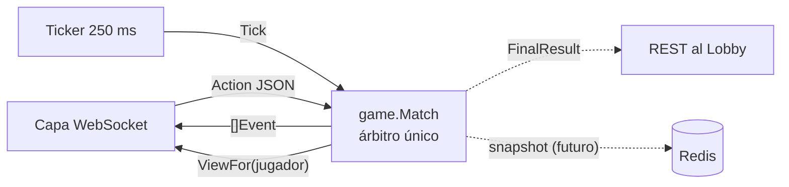
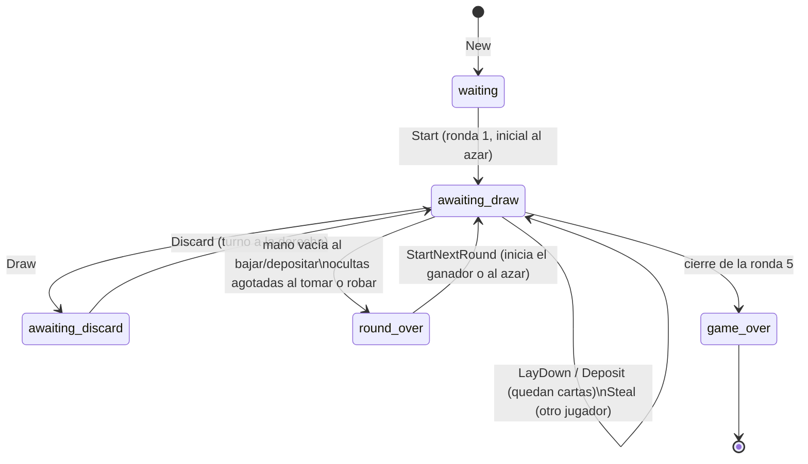

# Diseño: Game Logic Component (Go)

## 1. Ubicación en la arquitectura

En la vista C&C, el componente Go recibe las acciones de los jugadores por WebSocket (vía Traefik), consulta al Lobby por REST interno y guarda estado en Redis. Este módulo es el **núcleo de dominio** de ese componente: no abre sockets ni toca bases de datos. La capa de red y la de datos lo envuelven.



## 2. Paquetes

| Paquete | Contenido |
|---|---|
| `internal/game` | Motor puro: dominio, reglas, eventos, vistas, `Match` |
| `internal/bot` | Jugador automático para simulaciones y pruebas (no son reglas) |
| `cmd/simulate` | CLI que juega partidas completas con bots |

Los paquetes van en `internal/` porque solo los usan los ejecutables de este módulo. Las capas que faltan siguen el mismo patrón:

| Paquete futuro | Responsabilidad |
|---|---|
| `cmd/server` | Ejecutable del servicio (arma las capas y escucha) |
| `internal/transport/ws` | WebSocket: sesiones, `Action` → `Match.Apply`, difusión de eventos y vistas |
| `internal/store/redis` | Persistencia del estado de la partida |
| `internal/lobby` | Cliente REST interno hacia el Lobby Manager |

Archivos de `internal/game`:

| Archivo | Responsabilidad | RF |
|---|---|---|
| `card.go` | Carta, figura, mazo de 60, penalización | RF-12, RF-32 |
| `round.go` | Tipos de jugada y tabla de las 5 rondas | RF-13 |
| `meld.go` | Validación de jugadas y comodines | RF-26, RF-27 |
| `game.go` | Estado, creación, inicio y cierre de rondas, desempate | RF-12..RF-14, RF-30..RF-32, RF-35 |
| `actions.go` | Tomar, botar, robar, bajar, depositar | RF-15..RF-19, RF-21..RF-31 |
| `timer.go` | Plazo de turno, `Tick`, intercambio automático, conexión | RF-17, RF-20 |
| `view.go` | Vista filtrada por jugador | RF-33, RF-34, RF-22 |
| `events.go` | Eventos para difusión | RF-11 |
| `errors.go` | Errores con código estable y mensaje en español | RF-10 |
| `action.go` | `Action` serializable y `Apply` | integración |
| `match.go` | Envoltura concurrente (mutex) | RNF-02, RNF-03, RNF-05 |

## 3. Modelo y máquina de estados

- **Cartas**: IDs 0..55 normales (`Figure = id/8 + 1`, 7 figuras × 8) y 56..59 comodines. Los clientes siempre referencian cartas por ID.
- **Asientos**: el orden de `New(ids)` es el orden de la mesa; "hacia la derecha" = asiento + 1.
- **Banco de ocultas**: pila; se toma del final. No se rebaraja: si se agota cuando alguien debe tomar, la ronda termina sin ganador.
- **Banco de vistas**: pila; solo la última carta es tomable o robable (`discardAvailable`). Tras un robo o una toma queda bloqueada hasta el siguiente botado.
- **Bancos de depósito**: una por jugada bajada, con figura y dueño. Cualquier jugador que ya bajó puede depositar en cualquiera.



`Tick` y la desconexión ejecutan el intercambio automático desde `awaiting_draw` (toma oculta + bota la primera carta) o desde `awaiting_discard` (solo bota).

## 4. API

| Método | Uso |
|---|---|
| `NewMatch(ids, Config)` | 4 jugadores únicos. `Config` permite fijar duración del turno, `*rand.Rand` y `Clock` |
| `Start()` | Reparte la ronda 1 |
| `Apply(Action)` | Despacha `draw`, `discard`, `steal`, `lay_down`, `deposit` |
| `Tick()` | Aplica el intercambio automático si venció el turno |
| `SetConnected(p, bool)` | Marca conexión; un desconectado juega en automático de inmediato |
| `StartNextRound()` | Inicia la siguiente ronda tras `round_over` |
| `ViewFor(p)` | Estado visible para `p`, con indicadores `Can*` para la UI |
| `Results()`, `Final()` | Resultados por ronda y final |

Toda acción devuelve `([]Event, error)`. Si hay error, **el estado no cambia**. Los errores son `*game.Error{Code, Message}`; `game.CodeOf(err)` da el código para el cliente.

Ejemplos de `Action` en JSON:

```json
{"type":"draw","player":"ana","source":"hidden"}
{"type":"discard","player":"ana","card":12}
{"type":"steal","player":"beto"}
{"type":"lay_down","player":"ana","melds":[[0,1,56],[8,9,10,11]]}
{"type":"deposit","player":"ana","card":3,"bank":0}
```

Eventos: `round_started`, `turn_started`, `card_drawn`, `card_discarded`, `card_stolen`, `penalty_drawn`, `melds_laid_down`, `card_deposited`, `auto_exchange`, `player_connection`, `round_ended`, `game_ended`. Llevan `seq` monotónico. **Nunca revelan cartas ocultas**: `card_drawn` desde ocultas y `penalty_drawn` no incluyen la carta.

### Concurrencia

`Game` no es seguro para concurrencia. `Match` serializa cada operación con un mutex: la primera acción en adquirirlo se aplica completa y las siguientes se validan contra el estado nuevo. Así, entre dos robos simultáneos, o un robo y la toma del jugador en turno, solo uno obtiene la carta y el otro recibe `steal_not_allowed` o `discard_unavailable` (RF-25, RNF-03). Cada `Match` tiene su propio estado y su propio generador aleatorio (RNF-05).

## 5. Decisiones sobre reglas

| # | Tema | Decisión | Dónde cambiarla |
|---|---|---|---|
| D1 | Turno inicial de la ronda | Solo intercambio: toma de ocultas y bota; no puede bajar ni depositar (RF-15) | `LayDown`, chequeo `firstTurn` |
| D2 | Tamaño de jugadas | Exacto (trío = 3, cuarteto = 4). Las cartas extra se depositan después | `ValidateMeld` |
| D3 | Orden de las jugadas al bajar | Indiferente; se comparan los tamaños | `meldsMatchSpec` |
| D4 | Banco de vistas tras robo | La carta inferior no se puede tomar ni robar hasta el siguiente botado | `discardAvailable` |
| D5 | Robo sin ocultas para la penalización | El ladrón conserva la robada y la ronda termina sin ganador (RF-31) | `Steal` |
| D6 | Botar la carta recién tomada del banco de vistas | Permitido (el reglamento no lo prohíbe) | `Discard` |
| D7 | Bajar una vez por ronda | Sí; después solo deposita | `ErrAlreadyLaidDown` |
| D8 | Desempate persistente (reglamento §14.1) | Puntos → más rondas ganadas → menos puntos en la última ronda → ganadores compartidos | `computeFinal` |
| D9 | Desconexión prolongada (reglamento §14.2) | Intercambio automático inmediato en cada turno del desconectado; puede reconectarse | `runAutoTurns` |
| D10 | Inicio de ronda siguiente | Explícito con `StartNextRound`, para que la UI muestre el puntaje antes | `StartNextRound` |
| D11 | "Primera carta de la mano" | Orden interno: reparto y luego tomas, en orden de llegada. Si la UI reordena, hoy el servidor no lo sabe | `autoExchange` |
| D12 | Término del puntaje (§14.3) | El código usa "puntos negativos" / `Points` | — |

## 6. Datos que el reglamento deja abiertos

- D1 y D6 conviene confirmarlos con el equipo; cambiarlos es una línea cada uno, más su prueba.
- D11: si el cliente permite reordenar la mano, hace falta una acción `reorder_hand`.

## 7. Guía de integración para la capa de red

1. Crear un `Match` por sala cuando el Lobby inicie la partida, con los 4 IDs en orden de asiento.
2. Por cada mensaje WebSocket: decodificar `Action`, fijar `Player` a partir de la sesión autenticada del socket (no confiar en el campo enviado por el cliente) y llamar `Apply`.
3. Si hay error: responder solo a ese jugador con `{code, message}`.
4. Si hay eventos: difundirlos a los 4 y enviar a cada uno su `ViewFor`.
5. Llamar `Tick()` cada ~250 ms y difundir lo que devuelva.
6. Al cerrar o abrir un socket: `SetConnected`.
7. En `round_ended`: esperar unos segundos y llamar `StartNextRound`.
8. En `game_ended`: enviar `FinalResult` al Lobby por REST con una clave de idempotencia (ID de la partida) para cumplir RNF-04.
